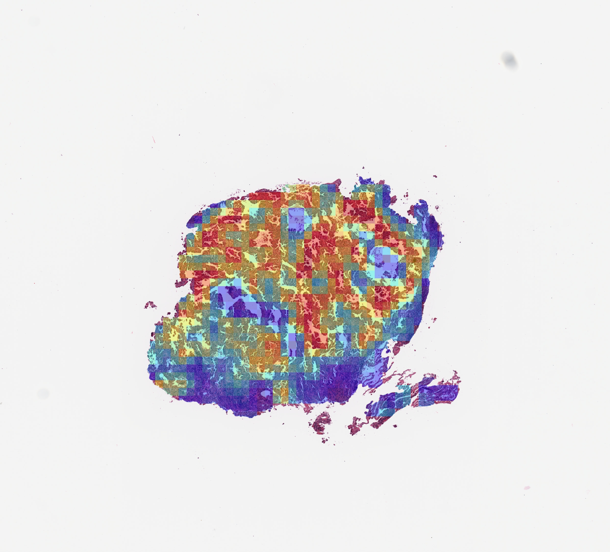
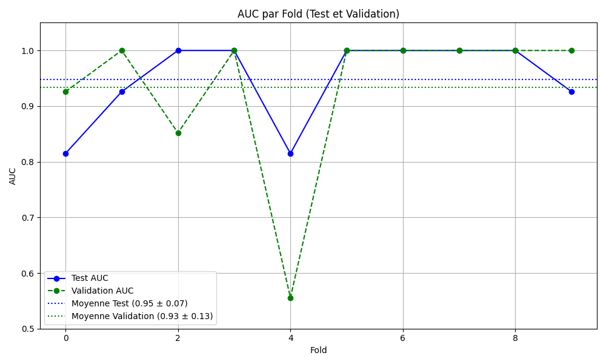

# HybMIL-FSelect – Pipeline de classification faiblement supervisée pour Whole Slide Images

Ce dépôt regroupe l’ensemble des scripts, configurations et ressources nécessaires à la mise en œuvre de l’approche HybMIL-FSelect. Cette méthode a été développée dans le cadre d’un mémoire de Master à la Faculté des Sciences et Techniques de Béni Mellal (FST-BM), Université Sultan Moulay Slimane.

---

## 1. Objectif

L’objectif principal est de proposer une approche légère et interprétable permettant la classification binaire de lames histologiques numériques (WSI) à partir d’annotations globales, dans un contexte de supervision faible. L’approche repose sur l’articulation de modules de traitement visuel, de sélection de caractéristiques et d’apprentissage par Multiple Instance Learning.

---

## 2. Description de l’approche

HybMIL-FSelect s’organise en quatre phases :

1. Découpage des images WSI en tuiles informatives à l’aide d’OpenSlide et d’un filtrage tissulaire en HSV.
2. Encodage visuel des tuiles avec le modèle pré-entraîné UNI, produisant des vecteurs de 1024 dimensions.
3. Filtrage stratégique des vecteurs par norme L2 et regroupement KMeans, afin de réduire le bruit visuel.
4. Classification finale par Multiple Instance Learning à l’aide du modèle CLAM_MB avec attention.

L’ensemble du pipeline a été exécuté sur la plateforme Kaggle avec GPU T4, dans un environnement Python 3.8.

<p align="center">
  
</p>

---
## 3. Structure du projet
<pre> 
├── dataset_csv/ # Fichiers CSV d’annotations 
├── dataset_modules/ # Prétraitement et loaders
├── heatmaps/ # Cartes d’attention générées 
├── models/ # Implémentation de CLAM_MB 
├── presets/ # Fichiers de configuration 
├── topk/ # Extraction des tuiles top-attention
├── utils/, vis_utils/ # Fonctions utilitaires 
├── wsi_core/ # Fonctions WSI & tiling
├── main.py # Script d’entraînement et test
├── create_patches_fp.py # Découpage en tuiles 
├── extract_features_fp.py # Encodage UNI 
├── filter_features_l2_kmeans.py 
├── create_heatmaps.py # Visualisation attention 
├── create_splits_seq.py # K-fold splits 
└── tumor_vs_normal_dummy_clean.csv  
</pre>
---

## 4. Données utilisées

- 📌 **Dataset** : [SLN-Breast – TCIA](https://wiki.cancerimagingarchive.net/display/Public/TCGA-BRCA)
- 130 lames `.svs` scannées à 20x
- Annotations binaires globales (présence / absence de métastases)
- Données organisées sous forme : `images/ + CSV (slide_id, label)`

---

## 5. Instructions de lancement

### Étape 1 : Découpage des lames

```bash
python create_patches_fp.py --source ./images --save_dir ./patches
```
<p align="center">
  
</p>

## Étape 2 : Encodage visuel

```bash
python extract_features_fp.py --model UNI --input ./patches --output ./features
```
## Étape 3 : Filtrage des vecteurs

```bash
python filter_features_l2_kmeans.py --input ./features --k 5
```
## Étape 4 : Entraînement CLAM_MB

```bash
python main.py --task train --config configs/hybmil.yaml
```
## Étape 5 : Génération de cartes d’attention

```bash
python create_heatmaps.py --model_path ./checkpoints/fold_1.pth
```
<p align="center">
  
</p>


## 6. Résultats obtenus

| Métrique   | Moyenne ± Écart-type (10-fold CV) |
|------------|------------------------------------|
| Accuracy   | 0.933 ± 0.086                       |
| F1-score   | 0.855 ± 0.192                       |
| AUC        | 0.948 ± 0.077                       |

<p align="center">
  
</p>


---

## 7. Configuration requise

- Python ≥ 3.8  
- PyTorch ≥ 1.10  
- OpenSlide  
- h5py  
- scikit-learn  
- pandas  

ℹ️ Voir `env.yml` ou `requirements.txt`.

---

## 8. Références principales

- Lu et al., *CLAM: Clustering-constrained Attention MIL* (2021)  
- Chen et al., *UNI: A Universal Image Encoder for Histopathology* (2024)  
- [TCIA – SLN-Breast Dataset](https://wiki.cancerimagingarchive.net/display/Public/TCGA-BRCA)

---

## 9. Auteur

**Nouhayla Skhounate**  
Master Intelligence Artificielle et Informatique Digitale  
Université Sultan Moulay Slimane – FST Béni Mellal  
Encadrée par **Pr. Abdelali Elmoufidi**


📄 [Télécharger le mémoire PDF](./docs/HybMIL-FSelect_Memoire.pdf)


